Q1
========
产生函数
--------
先定义一下组合：五个专家组成的一个集合。3000题，每题都要选一个组合

我们找了一个产生组合的方法，比如叫“产生函数”，输入一个中心元素（一位专家），生成一个对应的组合。这样可以使得每个专家对应一个组合，该过程可以描述为：
```
专家i对应的组合=产生函数(专家i)
```

最简单的产生函数
-------
由于有125位专家，我们应该都用上，因此需要均匀，同时又希望尽量使交集最大。那么最朴素的产生函数就是，对于专家i，取集合`{i, i+1, i+2, i+3, i+4}`

这里用的“加法”需要打个补丁，如果`i+j>125`，那么我们令其等于`i+j-125`（即超过了125就循环回1），如果不打这个补丁，那`1~4`和`121~125`所属的组合个数就和中间的不一样了。

扩大每个专家的共事范围
---------
可以观察到，我们用这种最简单的产生函数产生的前125种选择可以使每个专家都和其相邻的专家共同出现在五个集合中了。对于“尽量使交集最大”这个目标而言，相邻的两个专家i、j对应的组合一定重合四个，所以在相邻的情况下，实现“交集最大”了。

但专家i前面最远是i-4个专家，后面最远是i+4个专家，它与且仅与这9个专家共同出现过，我们现在要扩大这个范围，让它在其它组合中与更多的专家共同出现（即不仅在相邻的情况下有交集）——那么我们就需要其它的产生函数（每种产生函数产生125种组合，一共3000种组合，用24个产生函数）

产生函数要怎么变呢？刚才我们那种朴素的产生函数是取集合`{i, i+1, i+2, i+3, i+4}`。那我们想让专家i与更远的专家同时出现（而非仅与相邻的），那只需要把产生函数改成`{i, i+1+k, i+2+k……}`就可以控制其它专家和i的“距离”了

评估指标
-----------
题里要的是使交集尽可能大，那么我们要找个办法评估这个效果。对于3000题中的任一组合`{a1, a2, a3, a4, a5}`，我们可以计算其与剩下2999个组合的交集个数之和（此处应有公式，而且要给这个指标起个名，我这里先叫它`交集数和`了）。我们上面那个方法产生的结果是均匀的，不管是哪个元素，这个`交集数和`值都为595，而且极差为0

需要注意的是，我们不能片面地最大化`交集数和`，因为显然所有题都选同样组合的情况下`交集数和`最大（达到14995），然而这种情况我们只用了5个专家，剩下120个全都没用上。

我们以随机选择作为baseline和我们的方法对比。随机选择专家构成3000种组合的情况下，3000个`交集数和`服从正态分布，均值和中位数均为600。然而其`交集数和`较大是因为部分专家被重复抽取，看各个专家被抽的次数可以看出：
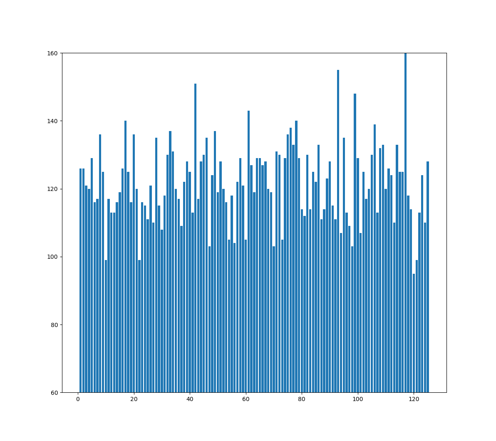

从`交集数和`的频数分布直方图可以看出，方差较大：
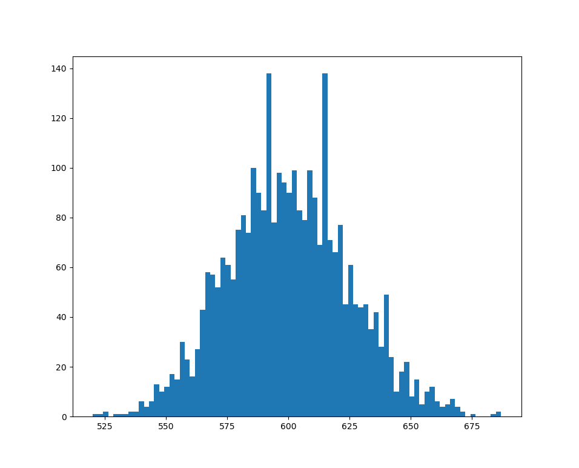

重复生成五次（每次生成3000个组合），`交集数和`的极差为146、154、133、155、146。显然这会造成大量题目选到的组合`交集数和`远远低于平均水平，造成不公平。

Q2
=========
假设一共有两道题，N个专家给分，此时标准分算法是适用的，因为这N个专家打分的对象是相同的，此时每个专家都有一个长度为2的特征向量，描述了该专家的打分风格，不同专家的打分风格是可以基于这个向量比较的。

但假设一共3000道题，构成一个长度为3000的向量，每个专家只打其中的一小部分，那么得到的特征矩阵是稀疏的（该矩阵在`Q2所有专家的特征向量（稀疏）.txt`），由于不同专家打分的题不同，他们的特征向量中非零值所在位置也不同，此时两个特征向量是无法比较的。

那么我们要把N个专家的特征向量构成的稀疏矩阵转化为能描述专家特征的稠密矩阵。可以使用奇异值分解（SVD）或者自编码器。

获得稠密矩阵之后我们就知道了每个专家的稠密特征向量。基于SSLM的思路，我们对这些稠密向量进行聚类。基于数据测试得聚两类比较好（聚多类的话各类别中元素数量过于不均衡），这两类可以描述为`喜欢打高分的专家组`和`喜欢打低分的专家组`~（虽然这种低维描述相对高维特征向量来说是不完备的，高维特征向量具体捕获了什么特征我们也说不清楚，只能给个大概的解释）~。然后可以继续按SSLM的方法修正评分（用的具体方法在下面的**SVD得到的稠密向量的聚类结果-一些结论**）

SVD得到的稠密向量的聚类结果
----------
### 各专家所属类别
``` python
{'P090': 1, 'P511': 1, 'P446': 0, 'P339': 1, 'P256': 0, 'P486': 1, 'P336': 0, 'P200': 1, 'P477': 0, 'P370': 1, 'P322': 1, 'P120': 0, 'P571': 0, 'P573': 0, 'P732': 1, 'P270': 1, 'P126': 0, 'P127': 0, 'P758': 1, 'P704': 0, 'P344': 0, 'P069': 0, 'P482': 1, 'P372': 1, 'P235': 1, 'P658': 0, 'P466': 0, 'P132': 1, 'P118': 0, 'P255': 0, 'P555': 1, 'P070': 0, 'P497': 0, 'P494': 1, 'P454': 1, 'P350': 0, 'P240': 0, 'P464': 0, 'P356': 0, 'P236': 1, 'P223': 0, 'P022': 1, 'P212': 0, 'P459': 0, 'P402': 1, 'P756': 1, 'P082': 0, 'P615': 0, 'P170': 0, 'P297': 0, 'P150': 0, 'P418': 1, 'P376': 1, 'P391': 1, 'P233': 1, 'P601': 0, 'P672': 1, 'P453': 0, 'P287': 0, 'P056': 1, 'P484': 0, 'P526': 0, 'P230': 0, 'P676': 0, 'P580': 0, 'P005': 0, 'P163': 0, 'P625': 0, 'P485': 0, 'P449': 0, 'P267': 0, 'P592': 1, 'P143': 0, 'P138': 0, 'P462': 0, 'P294': 1, 'P587': 1, 'P225': 1, 'P576': 0, 'P438': 0, 'P635': 0, 'P767': 1, 'P406': 1, 'P654': 0, 'P513': 1, 'P434': 0, 'P266': 0, 'P125': 0, 'P386': 1, 'P229': 1, 'P549': 1, 'P443': 0, 'P282': 1, 'P506': 1, 'P334': 0, 'P632': 0, 'P753': 1}
```
### 两类别专家打出的平均分的描述性统计
* 类别1条形图
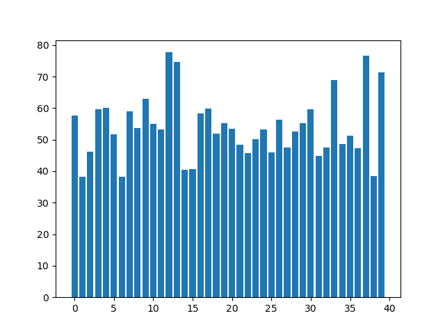
* 类别2条形图
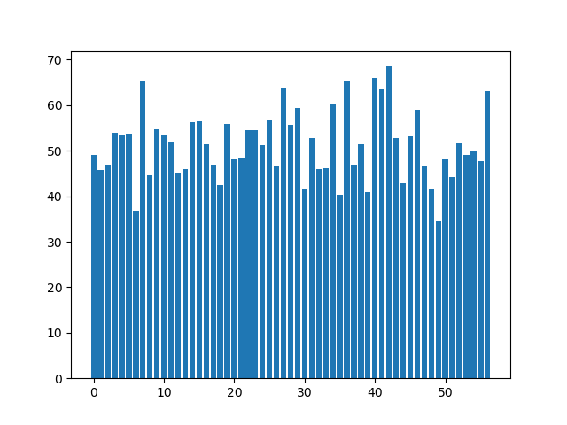
* 类别1：最大值77.69607843137256 最小值38.319526627218934 平均值53.94201095601261
* 类别2：最大值68.49019607843137 最小值34.54368932038835 平均值51.27405524393622
* t检验得p值为0.1380489346409096（两类平均分数据有0.13的概率是从同一个分布中抽出的，即有0.87的概率是在不同分布中抽出的（有差异））
* t检验的结果需要解释一下：一般来说，p值小于0.05才是有显著差异，但我们分类是针对高维向量的，然后现在为了给出一个人类可读的初步检验结果，才用两类别的专家打出分的平均值作为检验指标。平均分是一个很低维的指标，高维向量的很多信息换成平均分就被压缩没了，因此平均分的t检验结果不能完全衡量高维向量的差异大小（实际应该比这个更小），所以平均分的p值有0.13已经足够说明问题了

### 一些结论
从这里可以看出，把两个类别描述为`喜欢打高分的专家组`和`喜欢打低分的专家组`的合理的。基于这个描述，我们可以求两类中心坐标的中点作为“打分正合适的专家的特征向量”，然后对于每个专家，根据该专家特征向量与这个特征向量的余弦距离作为指标，对其所有打分进行修正。

由于一共有97个专家，所以SVD得到的矩阵U的shape为`97*97`，单个特征向量维度为97。维度还是比较大的，所以求出的中点有些分量的值还是比较小。因此我们在SVD的基础上对得到的矩阵U再进行PCA降维，使单个特征向量维度为50，然后再计算中点和余弦距离，最终使用余弦距离乘一个系数作为差值修正原始分，得到最终结果。

需要注意！！我们使用的稠密矩阵（扔给PCA降维那个）不是U，而是U中的每个特征向量和SVD得到的对角向量S逐元素相乘（S表示U每个维度的权重）。即对于U的第i行，有
```
U'_i = U_i⊙S
```

自编码器得到的稠密向量的聚类结果
-------------
先简单介绍下自编码器，自编码器是一种神经网络，结构是这样的：
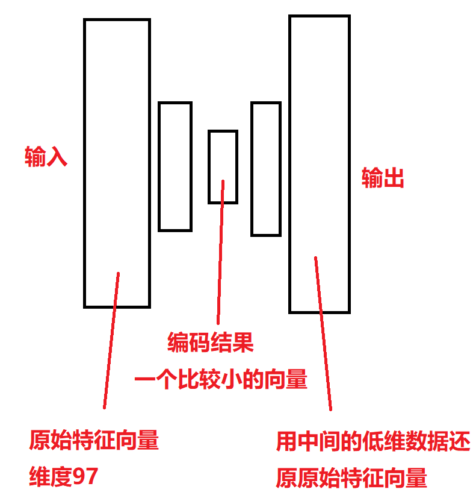
这个网络做的任务是先把原始数据（高维向量）转换成（相对）低维的向量，再用这个向量还原原始数据。既然能用低维向量还原回原始数据，就证明这个低维向量没有损失信息，就是把原始数据压缩了。做这个的难点是神经网络训练需要调参的，如果不仔细调参可能结果不是很好。我没仔细调，所以结果也不是很好。由于SVD那种方法用PCA降维了，因此本方法也尝试让编码向量取50、30两种，最终测试表明50效果更好。结果如下：

### 各专家所属类别
``` python
{'P090': 0, 'P511': 0, 'P446': 0, 'P339': 0, 'P256': 0, 'P486': 0, 'P336': 0, 'P200': 0, 'P477': 0, 'P370': 0, 'P322': 0, 'P120': 0, 'P571': 0, 'P573': 0, 'P732': 0, 'P270': 0, 'P126': 0, 'P127': 0, 'P758': 0, 'P704': 0, 'P344': 0, 'P069': 0, 'P482': 0, 'P372': 1, 'P235': 0, 'P658': 0, 'P466': 0, 'P132': 1, 'P118': 1, 'P255': 0, 'P555': 0, 'P070': 0, 'P497': 1, 'P494': 0, 'P454': 0, 'P350': 0, 'P240': 0, 'P464': 0, 'P356': 1, 'P236': 1, 'P223': 0, 'P022': 0, 'P212': 0, 'P459': 0, 'P402': 0, 'P756': 0, 'P082': 1, 'P615': 1, 'P170': 1, 'P297': 0, 'P150': 0, 'P418': 0, 'P376': 0, 'P391': 0, 'P233': 0, 'P601': 0, 'P672': 0, 'P453': 0, 'P287': 0, 'P056': 0, 'P484': 0, 'P526': 0, 'P230': 0, 'P676': 0, 'P580': 1, 'P005': 0, 'P163': 1, 'P625': 1, 'P485': 0, 'P449': 0, 'P267': 0, 'P592': 0, 'P143': 0, 'P138': 0, 'P462': 0, 'P294': 0, 'P587': 0, 'P225': 0, 'P576': 0, 'P438': 0, 'P635': 0, 'P767': 0, 'P406': 0, 'P654': 0, 'P513': 0, 'P434': 0, 'P266': 0, 'P125': 0, 'P386': 0, 'P229': 0, 'P549': 0, 'P443': 1, 'P282': 1, 'P506': 0, 'P334': 0, 'P632': 1, 'P753': 1}
```
### 两类别专家打出的平均分的描述性统计
* 类别1条形图
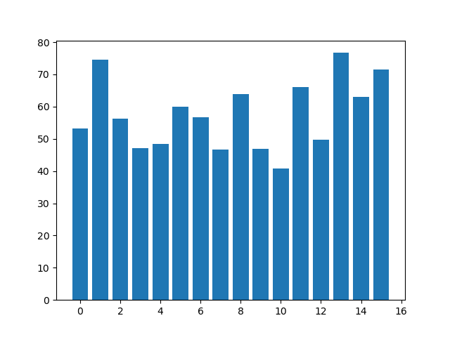
* 类别2条形图

* 类别1：最大值76.69902912621359 最小值40.883495145631066 平均值57.59019913000196
* 类别2：最大值77.69607843137256 最小值34.54368932038835 平均值51.343930877343674
* t检验得p值为0.008。看起来比上一种好，但实际评估效果差，从侧面说明了用低维数据做t检验误差比较大

### 一些结论
修正方法和上面一致，结果看下面，不如题里给的标准分好。但效果不好也不一定是方法不行，可能只是没精细调参，这个无法确定。

评估
--------
由于题里说了**一等奖作品排序是准确的**（按复议分算的）。所以标准分计算方法好坏的评估标准为**按该标准分产生的排序与一等奖作品排序的一致程度**。我们以新排序和正确排序之差的绝对值之和（此处应有公式）衡量。
* 题中所给出的标准分，该指标为120（baseline）
* 题中所给出的原始分，该指标为140（baseline）
* SVD得到的稠密特征向量的修正结果，该指标为114（完整的修正结果在`Q2修正结果.xlsx`）
* 自编码器得到的稠密特征向量的修正结果，该指标为128

Q3
========

讨论两阶段成绩和极差的整体变化
------------
用线性回归看看相关性

### 数据2.1
#### 一阶段极差~二阶段极差
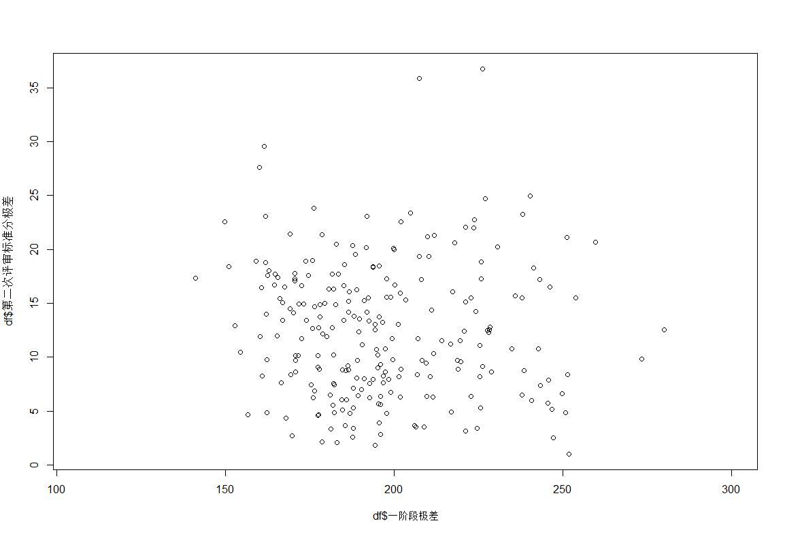
```
Residuals:
     Min       1Q   Median       3Q      Max 
-11.3369  -4.7691  -0.4915   4.3354  22.5558 

Coefficients:
              Estimate Std. Error t value Pr(>|t|)    
(Intercept)   10.13510    1.03648   9.778   <2e-16 ***
df$一阶段极差  0.16042    0.06555   2.447   0.0151 *  
---
Signif. codes:  0 ‘***’ 0.001 ‘**’ 0.01 ‘*’ 0.05 ‘.’ 0.1 ‘ ’ 1

Residual standard error: 6.143 on 238 degrees of freedom
  (因为不存在，645个观察量被删除了)
Multiple R-squared:  0.02455,	Adjusted R-squared:  0.02045 
F-statistic:  5.99 on 1 and 238 DF,  p-value: 0.01511
```
基本没有相关性

#### 二阶段极差~一阶段成绩
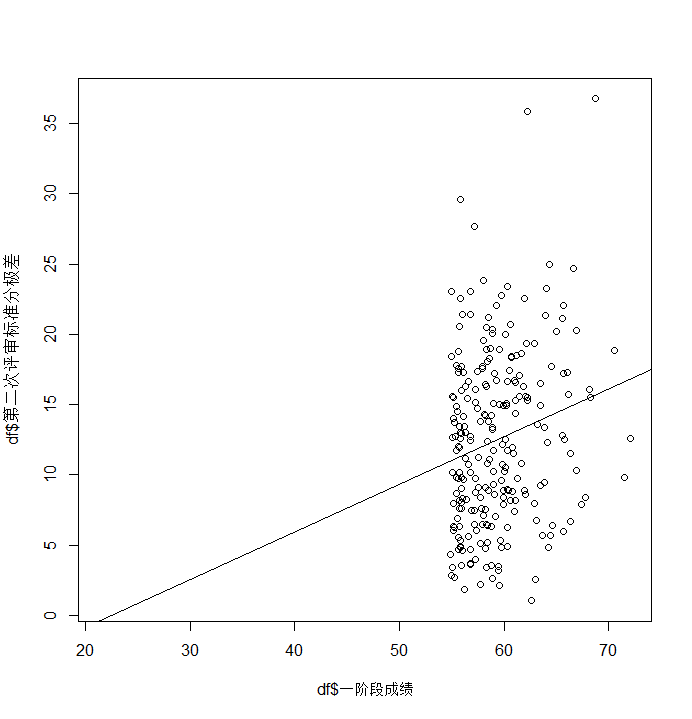
```
Residuals:
     Min       1Q   Median       3Q      Max 
-12.5715  -4.7540  -0.5732   4.2435  22.4029 

Coefficients:
              Estimate Std. Error t value Pr(>|t|)   
(Intercept)    -7.5935     6.5583  -1.158  0.24808   
df$一阶段成绩   0.3385     0.1104   3.066  0.00242 **
---
Signif. codes:  0 ‘***’ 0.001 ‘**’ 0.01 ‘*’ 0.05 ‘.’ 0.1 ‘ ’ 1

Residual standard error: 6.1 on 238 degrees of freedom
  (因为不存在，645个观察量被删除了)
Multiple R-squared:  0.038,	Adjusted R-squared:  0.03396 
F-statistic: 9.401 on 1 and 238 DF,  p-value: 0.002419
```
基本没有相关性

#### 最终成绩~一阶段极差
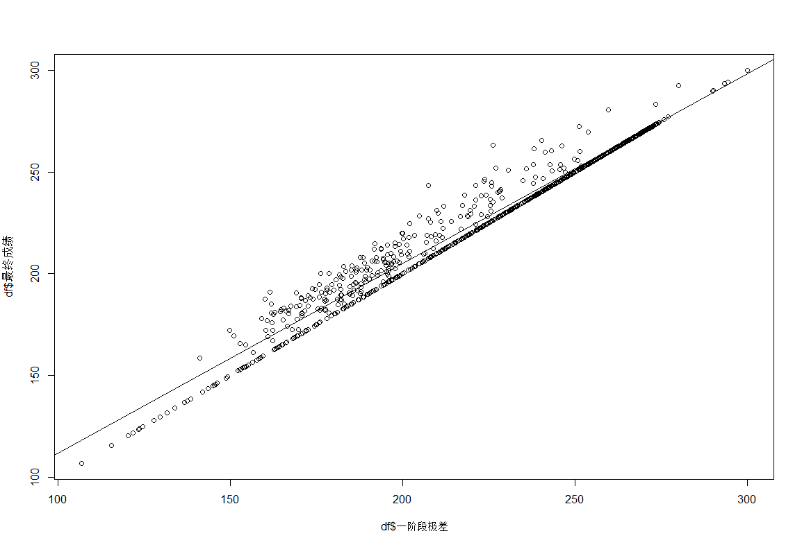
```
Residuals:
     Min       1Q   Median       3Q      Max 
-119.930  -25.016    6.229   28.905   73.548 

Coefficients:
               Estimate Std. Error t value Pr(>|t|)    
(Intercept)   226.09772    2.96763  76.188   <2e-16 ***
df$一阶段极差   0.03743    0.21053   0.178    0.859    
```
没有相关性

#### 最终成绩~一阶段成绩
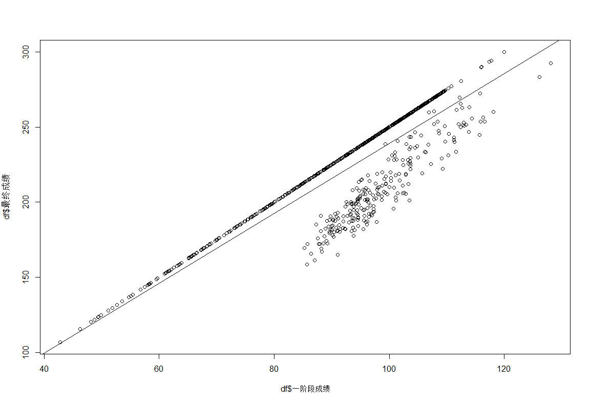
```
Residuals:
    Min      1Q  Median      3Q     Max 
-82.407 -25.454   8.907  26.207  53.920 

Coefficients:
              Estimate Std. Error t value Pr(>|t|)    
(Intercept)   128.5513     6.1809   20.80   <2e-16 ***
df$一阶段成绩   1.9586     0.1217   16.09   <2e-16 ***
---
Signif. codes:  0 ‘***’ 0.001 ‘**’ 0.01 ‘*’ 0.05 ‘.’ 0.1 ‘ ’ 1

Residual standard error: 30.81 on 883 degrees of freedom
Multiple R-squared:  0.2267,	Adjusted R-squared:  0.2258 
F-statistic: 258.8 on 1 and 883 DF,  p-value: < 2.2e-16
```
大体正相关，但是一阶段成绩比较大的作品里有一批最终成绩相对低，说明一阶段成绩不能完全反应作品品质（可能一阶段成绩是虚高的）

### 数据2.2
#### 二阶段极差~一阶段极差
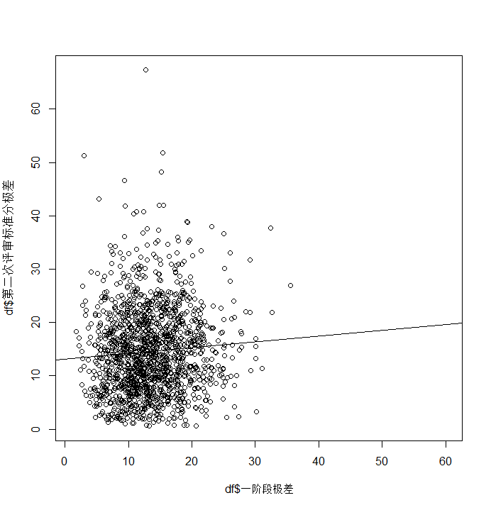
```
Residuals:
    Min      1Q  Median      3Q     Max 
-14.805  -5.907  -0.791   4.857  52.800 

Coefficients:
              Estimate Std. Error t value Pr(>|t|)    
(Intercept)   13.15914    0.57664   22.82  < 2e-16 ***
df$一阶段极差  0.10696    0.04006    2.67  0.00766 ** 
---
Signif. codes:  0 ‘***’ 0.001 ‘**’ 0.01 ‘*’ 0.05 ‘.’ 0.1 ‘ ’ 1

Residual standard error: 7.984 on 1498 degrees of freedom
  (因为不存在，7829个观察量被删除了)
Multiple R-squared:  0.004737,	Adjusted R-squared:  0.004072 
F-statistic:  7.13 on 1 and 1498 DF,  p-value: 0.007664
```
基本没有相关性

#### 二阶段极差~一阶段成绩
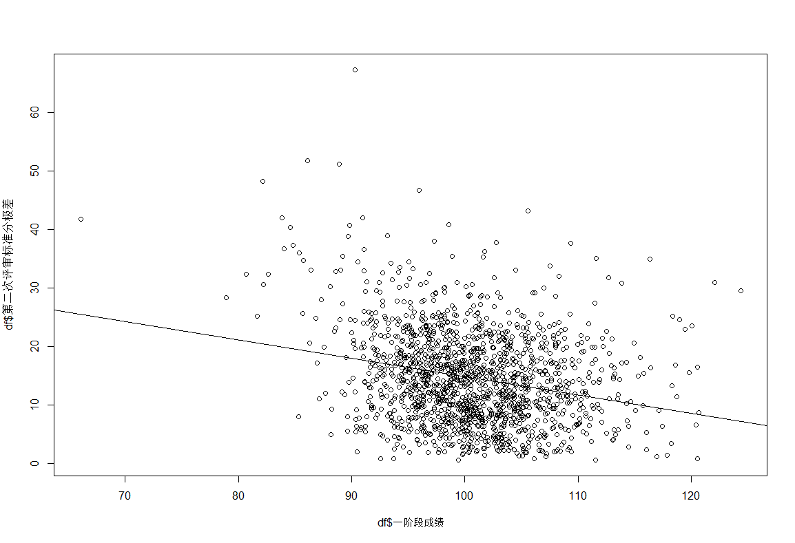
```
Residuals:
    Min      1Q  Median      3Q     Max 
-16.376  -5.693  -0.660   4.852  49.486 

Coefficients:
              Estimate Std. Error t value Pr(>|t|)    
(Intercept)   46.12174    3.24347  14.220   <2e-16 ***
df$一阶段成绩 -0.31325    0.03217  -9.738   <2e-16 ***
---
Signif. codes:  0 ‘***’ 0.001 ‘**’ 0.01 ‘*’ 0.05 ‘.’ 0.1 ‘ ’ 1

Residual standard error: 7.761 on 1498 degrees of freedom
  (因为不存在，7829个观察量被删除了)
Multiple R-squared:  0.05954,	Adjusted R-squared:  0.05891 
F-statistic: 94.83 on 1 and 1498 DF,  p-value: < 2.2e-16
```
有一定负相关性，可能说明**一阶段成绩越高的的作品在二阶段争议越小**；**一阶段成绩越低的作品在二阶段争议越大**。说明一阶段评分是比较中规中矩的。由于回归线上的部分离散程度大，所以后者效应是相对不明显的，前者更明显

#### 最终成绩~一阶段极差
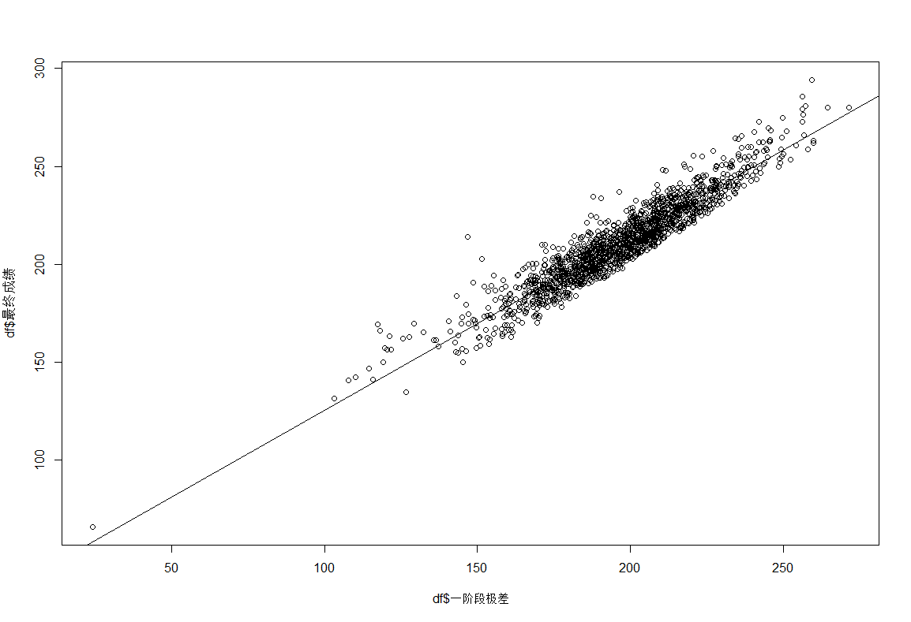
```
Residuals:
     Min       1Q   Median       3Q      Max 
-144.811  -14.193    0.088   14.416   82.943 

Coefficients:
              Estimate Std. Error t value Pr(>|t|)    
(Intercept)   209.9237     1.6227 129.363   <2e-16 ***
df$一阶段极差   0.0885     0.1127   0.785    0.433  
```
没有相关性

#### 最终成绩~一阶段成绩

```
Residuals:
    Min      1Q  Median      3Q     Max 
-37.945  -6.703   0.118   6.423  38.485 

Coefficients:
                Estimate Std. Error t value Pr(>|t|)    
(Intercept)   -113.97513    4.16959  -27.34   <2e-16 ***
df$一阶段成绩    3.23027    0.04135   78.12   <2e-16 ***
---
Signif. codes:  0 ‘***’ 0.001 ‘**’ 0.01 ‘*’ 0.05 ‘.’ 0.1 ‘ ’ 1

Residual standard error: 9.977 on 1498 degrees of freedom
  (因为不存在，7829个观察量被删除了)
Multiple R-squared:  0.8029,	Adjusted R-squared:  0.8028 
F-statistic:  6102 on 1 and 1498 DF,  p-value: < 2.2e-16
```
显著正相关

调整一阶段不高不低分的极差
------------
由于题里说了，第二阶段通过复议调整了极差，所以复议前后极差的变化是可以参考的。但我做了`复议后极差~复议前极差`和`复议后极差~复议前标准分1+标准分2+标准分3`两个模型，都没看出相关性，所以参考这条路行不通。

没办法，先看下极差的分布：
* 数据2.1极差：
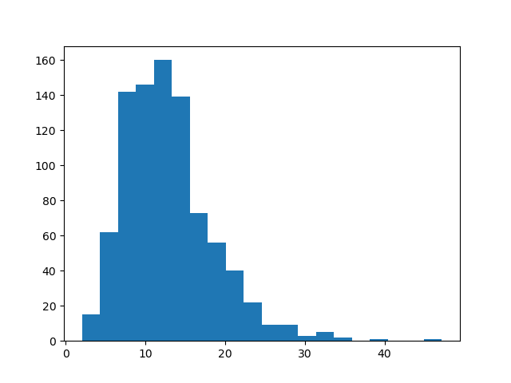
* 数据2.2极差：
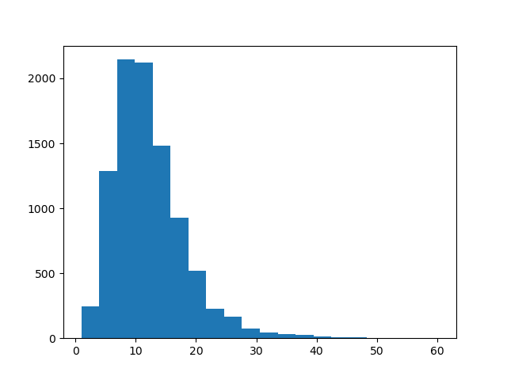

二者都是左偏+右拖尾。然后题里要求调整第一阶段不高不低分段的极差，我们先看下“不高不低分段”到底是多少，取百分位区间15%~85%：
* 数据2.1百分位区间：
```
    15%     20%     30%     40%     50%     60%     70%     85% 
41.6380 43.7388 47.2320 49.4088 51.1940 52.8912 54.3624 58.3136 
```
* 数据2.2百分位区间：
```
    15%     20%     30%     40%     50%     60%     70%     85% 
39.9788 42.8452 46.6760 49.3144 51.4060 53.2576 55.2180 58.5020 
```

我们把区间之外的极差都截掉，再画图：
* 数据2.1极差：
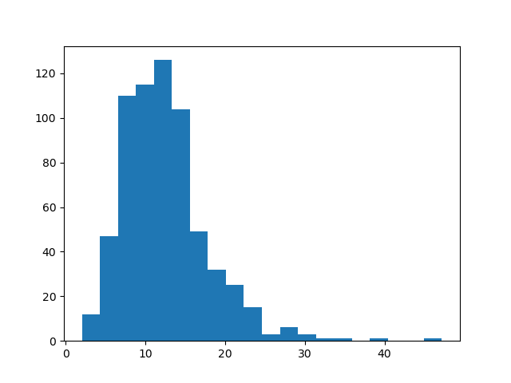
* 数据2.2极差：
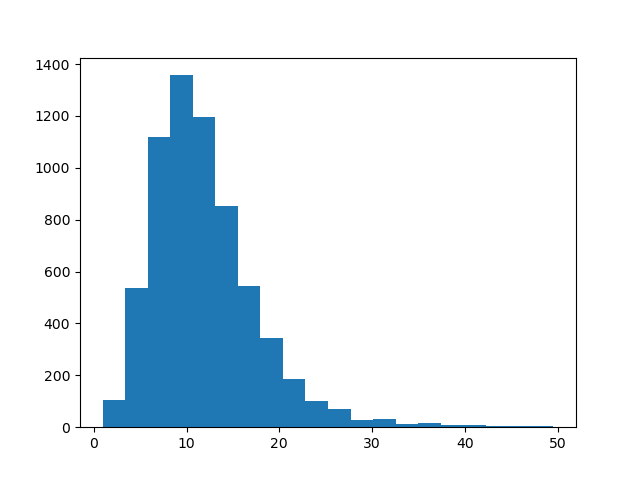
没啥区别