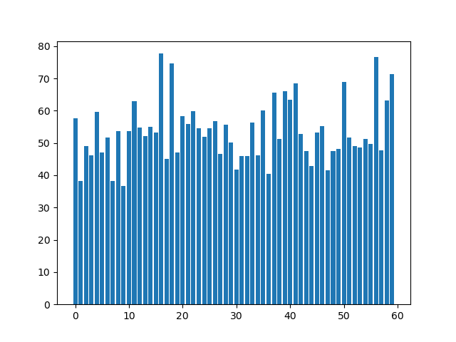
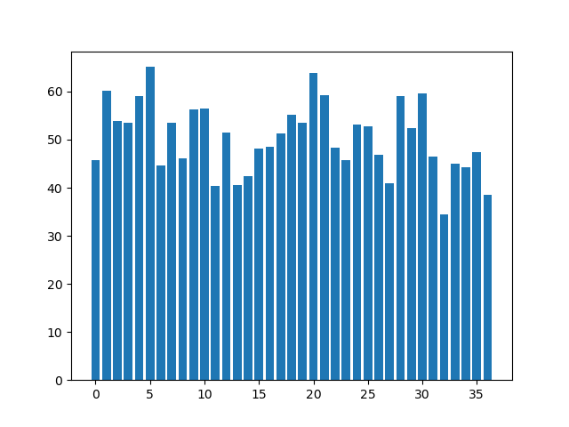

Q1
========
产生函数
--------
先定义一下组合：五个专家组成的一个集合。3000题，每题都要选一个组合

我们找了一个产生组合的方法，比如叫“产生函数”，输入一个中心元素（一位专家），生成一个对应的组合。这样可以使得每个专家对应一个组合，该过程可以描述为：
```
专家i对应的组合=产生函数(专家i)
```

最简单的产生函数
-------
由于有125位专家，我们应该都用上，因此需要均匀，同时又希望尽量使交集最大。那么最朴素的产生函数就是，对于专家i，取集合`{i, i+1, i+2, i+3, i+4}`

这里用的“加法”需要打个补丁，如果`i+j>125`，那么我们令其等于`i+j-125`（即超过了125就循环回1），如果不打这个补丁，那`1~4`和`121~125`所属的组合个数就和中间的不一样了。

扩大每个专家的共事范围
---------
可以观察到，我们用这种最简单的产生函数产生的前125种选择可以使每个专家都和其相邻的专家共同出现在五个集合中了。对于“尽量使交集最大”这个目标而言，相邻的两个专家i、j对应的组合一定重合四个，所以在相邻的情况下，实现“交集最大”了。

但专家i前面最远是i-4个专家，后面最远是i+4个专家，它与且仅与这9个专家共同出现过，我们现在要扩大这个范围，让它在其它组合中与更多的专家共同出现（即不仅在相邻的情况下有交集）——那么我们就需要其它的产生函数（每种产生函数产生125种组合，一共3000种组合，用24个产生函数）

产生函数要怎么变呢？刚才我们那种朴素的产生函数是取集合`{i, i+1, i+2, i+3, i+4}`。那我们想让专家i与更远的专家同时出现（而非仅与相邻的），那只需要把产生函数改成`{i, i+1+k, i+2+k……}`就可以控制其它专家和i的“距离”了

评估指标
-----------
题里要的是使交集尽可能大，那么我们要找个办法评估这个效果。对于3000题中的任一组合`{a1, a2, a3, a4, a5}`，我们可以计算其与剩下2999个组合的交集个数之和（此处应有公式，而且要给这个指标起个名，我这里先叫它`交集数和`了）。我们上面那个方法产生的结果是均匀的，不管是哪个元素，这个`交集数和`值都为595，而且极差为0

需要注意的是，我们不能片面地最大化`交集数和`，因为显然所有题都选同样组合的情况下`交集数和`最大（达到14995），然而这种情况我们只用了5个专家，剩下120个全都没用上。

我们以随机选择作为baseline和我们的方法对比。随机选择专家构成3000种组合的情况下，3000个`交集数和`服从正态分布，均值和中位数均为600。然而其`交集数和`较大是因为部分专家被重复抽取，看各个专家被抽的次数可以看出：


从`交集数和`的频数分布直方图可以看出，方差较大：


重复生成五次（每次生成3000个组合），`交集数和`的极差为146、154、133、155、146。显然这会造成大量题目选到的组合`交集数和`远远低于平均水平，造成不公平。

Q2
=========
假设一共有两道题，N个专家给分，此时标准分算法是适用的，因为这N个专家打分的对象是相同的，此时每个专家都有一个长度为2的特征向量，描述了该专家的打分风格，不同专家的打分风格是可以基于这个向量比较的。

但假设一共3000道题，构成一个长度为3000的向量，每个专家只打其中的一小部分，那么得到的特征矩阵是稀疏的（该矩阵在`Q2所有专家的特征向量（稀疏）.txt`），由于不同专家打分的题不同，他们的特征向量中非零值所在位置也不同，此时两个特征向量是无法比较的。

那么我们要把N个专家的特征向量构成的稀疏矩阵转化为能描述专家特征的稠密矩阵。可以使用奇异值分解（SVD）或者自编码器。

获得稠密矩阵之后我们就知道了每个专家的稠密特征向量。基于SSLM的思路，我们对这些稠密向量进行聚类。基于数据测试得聚两类比较好（聚多类的话各类别中元素数量过于不均衡），这两类可以描述为`喜欢打高分的专家组`和`喜欢打低分的专家组`~（虽然这种低维描述相对高维特征向量来说是不完备的，高维特征向量具体捕获了什么特征我们也说不清楚，只能给个大概的解释）~。然后可以继续按SSLM的方法修正评分

SVD稠密向量的聚类结果
----------
### 各专家所属类别
``` python
{'P090': 1, 'P511': 1, 'P446': 1, 'P339': 1, 'P256': 0, 'P486': 1, 'P336': 1, 'P200': 0, 'P477': 0, 'P370': 1, 'P322': 1, 'P120': 0, 'P571': 1, 'P573': 1, 'P732': 0, 'P270': 1, 'P126': 0, 'P127': 0, 'P758': 1, 'P704': 1, 'P344': 0, 'P069': 1, 'P482': 1, 'P372': 1, 'P235': 1, 'P658': 1, 'P466': 0, 'P132': 1, 'P118': 0, 'P255': 0, 'P555': 0, 'P070': 0, 'P497': 1, 'P494': 0, 'P454': 1, 'P350': 0, 'P240': 1, 'P464': 0, 'P356': 0, 'P236': 1, 'P223': 1, 'P022': 1, 'P212': 1, 'P459': 0, 'P402': 0, 'P756': 0, 'P082': 1, 'P615': 1, 'P170': 0, 'P297': 1, 'P150': 0, 'P418': 0, 'P376': 0, 'P391': 1, 'P233': 0, 'P601': 1, 'P672': 1, 'P453': 0, 'P287': 1, 'P056': 1, 'P484': 1, 'P526': 1, 'P230': 1, 'P676': 1, 'P580': 0, 'P005': 1, 'P163': 0, 'P625': 1, 'P485': 1, 'P449': 1, 'P267': 1, 'P592': 1, 'P143': 1, 'P138': 1, 'P462': 0, 'P294': 0, 'P587': 1, 'P225': 0, 'P576': 0, 'P438': 1, 'P635': 0, 'P767': 0, 'P406': 1, 'P654': 1, 'P513': 1, 'P434': 0, 'P266': 1, 'P125': 1, 'P386': 1, 'P229': 1, 'P549': 0, 'P443': 1, 'P282': 1, 'P506': 0, 'P334': 1, 'P632': 1, 'P753': 1}
```
### 两类别专家打出的平均分的描述性统计
* 类别1条形图

* 类别2条形图

* 类别1：最大值77.69607843137256 最小值36.75 平均值53.60923639814696
* 类别2：最大值65.13592233009709 最小值34.54368932038835 平均值50.37155143935275
* t检验得p值为0.07499205175196061（两类平均分数据有0.07的概率是从同一个分布中抽出的，即有0.93的概率是在不同分布中抽出的（有较大差异））
* t检验的结果需要解释一下：一般来说，p值小于0.05才是有显著差异，但我们分类是针对高维向量的，然后现在为了给出一个人类可读的初步检验结果，才用两类别的专家打出分的平均值作为检验指标。平均分是一个很低维的指标，高维向量的很多信息换成平均分就被压缩没了，因此平均分的t检验结果不能完全衡量高维向量的差异大小（实际应该比这个更小），所以平均分的p值有0.13已经足够说明问题了

### 一些结论
从这里可以看出，把两类描述为`喜欢打高分的专家组`和`喜欢打低分的专家组`的合理的。基于这个描述，我们可以求两类中心坐标的中点作为“打分正合适的专家的特征向量”，然后对于每个专家，根据该专家特征向量与这个特征向量的余弦距离作为指标，对其所有打分进行修正。

评估
--------
由于题里说了**一等奖作品排序是准确的**（按复议分算的）。所以标准分计算方法好坏的评估标准为**按该标准分产生的排序与一等奖作品排序的一致程度**。我们以新排序和正确排序之差的绝对值之和（此处应有公式）衡量。
* 题中所给出的标准分，该指标为120